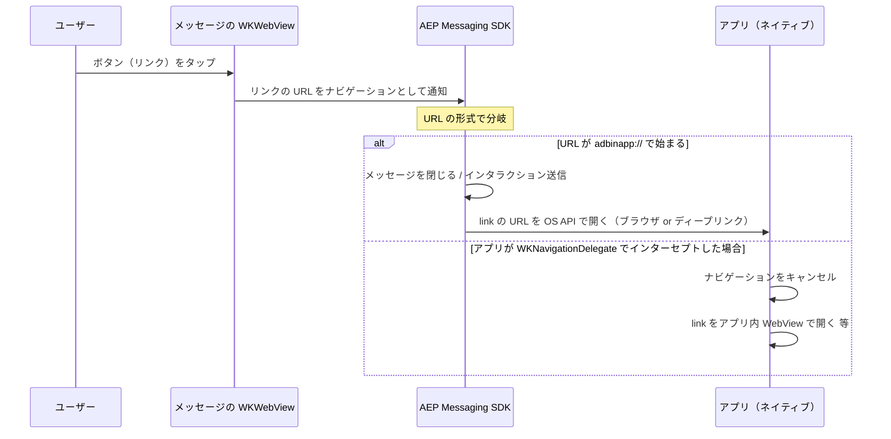
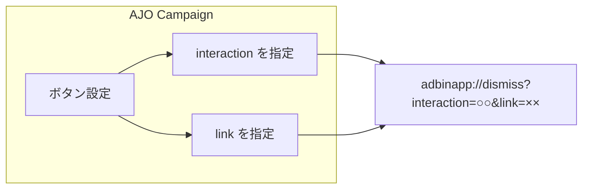
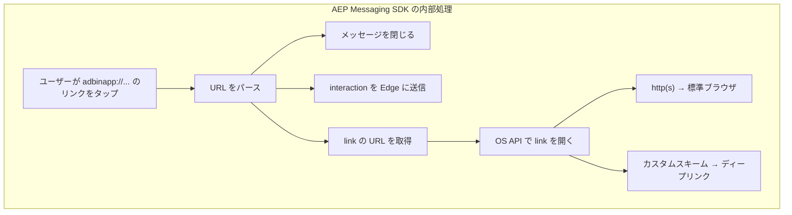
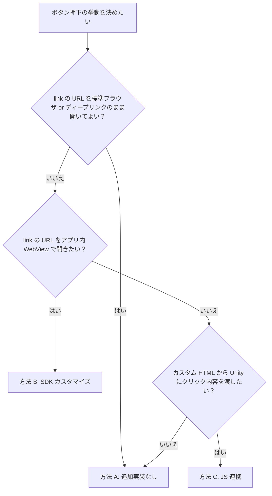
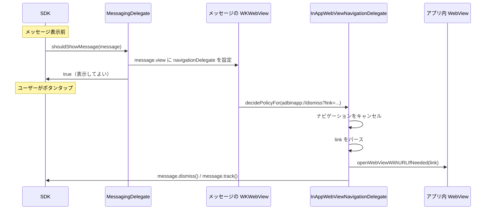
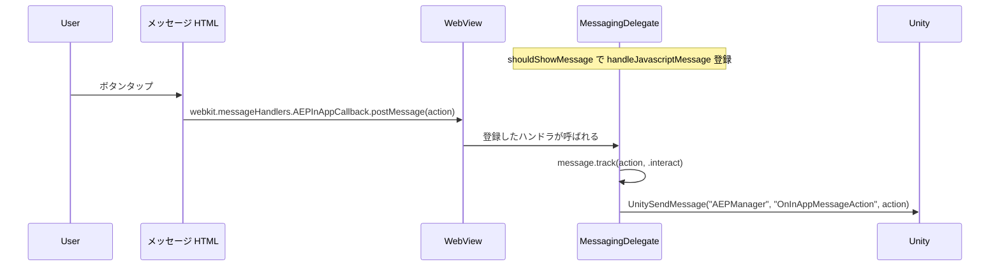

# AJO In-App Message のボタン押下挙動

Adobe Journey Optimizer (AJO) の In-App Message で、**ボタンを押したときの挙動**をどう決めるかを、ストーリー順にまとめる。Wiki 用に構成と図を整理している。

参照: [In-App Messaging - Adobe Developer](https://developer.adobe.com/client-sdks/edge/adobe-journey-optimizer/in-app-message/)

---

## 0. In-App Message 配信のための必須作業

本ドキュメント（ボタン押下挙動）の前提として、In-App Message を配信するために必要な設定をまとめる。詳細は [In-app channel prerequisites and configuration](https://experienceleague.adobe.com/en/docs/journey-optimizer/using/channels/in-app/inapp-configuration) を参照。

### Data Stream の定義

- **Adobe Experience Platform Data Collection** で Data Stream を定義する。
- **Adobe Experience Platform** サービスで **Adobe Experience Platform Edge** および **Adobe Journey Optimizer** を有効にする（AEP への転送と Edge での配信のため）。
- **AJO Push Tracking Experience Event Dataset**（レポート用データセット）を Data Stream の設定で利用するデータセットに含める。
- **Adobe Experience Platform** 側で、デフォルトのマージポリシーに **Active-On-Edge** を有効化しておく（Journey Optimizer のインバウンド配信に必要）。

あわせて、**AJO の Administration > Channels > Channel configurations** で In-App チャネル設定を作成し、対象アプリの **App ID** を登録する。

### Data Collection Tags の定義

- **Extension** に **AEP Edge Network** を追加する。
- **Rule** を 1 本作成し、次を設定する。
  - **EVENTS**: **Lifecycle Application Foreground** と **Lifecycle Application Background** の 2 つを定義する。
  - **ACTIONS**: **Adobe Experience Platform Edge Network - Forward event to Edge Network** を追加する。

### Schema に Lifecycle 用 Field group を追加

- In-App 実装で利用する Data Stream が参照する **Experience Event スキーマ**に、Lifecycle 用の **Field group** を追加する（レポートおよびライフサイクルデータの取り込みのため）。

### アプリの実装

- **Lifecycle 拡張の導入**
  - **Android**: `implementation 'com.adobe.marketing.mobile:lifecycle'` を追加する。
  - **iOS**: `pod 'AEPLifecycle'` を追加する。
- **初期化方法によるコード**
  - **MobileCore.initialize(appId:)** で SDK を初期化している場合は、上記拡張を入れるだけで Lifecycle は自動収集されるため、追加のコードは不要。
  - **MobileCore.registerExtensions** で初期化している場合は、**MobileCore.lifecycleStart(additionalContextData:)** と **MobileCore.lifecyclePause()** を適切なタイミング（アプリのフォアグラウンド／バックグラウンド遷移）で実行する。

---

## 1. このドキュメントで分かること

- In-App Message のボタンタップから、メッセージが閉じる・リンクが開くまで**どこで何が起きるか**
- AJO Campaign では**何をどこまで設定できるか**（固定されている部分と編集できる部分）
- **アプリ内 WebView で開く**など、標準以外の挙動を実現する場合の考え方と実装方針

---

## 2. 全体の流れ（ボタン押下からリンクが開くまで）

In-App Message は、AJO で作成したメッセージをアプリ内の **WKWebView** で表示する。ユーザーがボタン（リンク）を押すと、次のような流れになる。

**ポイント**: ボタンのリンク先 URL の**形式**によって、SDK が「閉じる＋リンクを開く」を行うか、アプリが先にインターセプトして別の動きにするかが決まる。

---

## 3. AJO Campaign で設定できること（ボタン URL）

AJO Campaign の In-App Message では、**ボタンの「クリック先 URL」**を設定する。

### 3.1 標準の Campaign UI で設定する場合

| 項目 | 内容 |
|------|------|
| **URL の形式** | **固定**。ボタンの URL は常に `adbinapp://dismiss?interaction=...&link=...` の形式になる。 |
| **編集できるもの** | **`interaction` の値**（例: `webview`, `cta1`）と **`link` の値**（開かせる先の URL）。ホスト（`dismiss`）の変更や、`adbinapp` 以外のスキームにはできない。 |
| **編集できないもの** | スキーム（`adbinapp`）、ホスト（`dismiss`）、クエリ名（`interaction`, `link`）。Campaign の UI ではこれらは選べない。 |

つまり、**「どの action か」と「開く先の URL（link）」だけを変えられる**と理解すればよい。

### 3.2 カスタム HTML を編集できる場合

メッセージを**カスタム HTML**で作成・編集できる場合のみ、**リンクの URL を自由に書く**ことができる（`adbinapp://` 以外の URL や、JavaScript の `postMessage` など）。その場合は「4. SDK の標準の動き」の対象外になる。

---

## 4. SDK の標準の動き（ボタン URL の解釈）

Campaign で設定したボタン URL は、**`adbinapp://` で始まる形式**でメッセージに渡る。この形式は **SDK が専用に解釈する**もので、アプリが「自分の URL スキーム」として登録するものではない。

### 4.1 誰が何をするか

- **SDK**: メッセージ内の **WKWebView** で `adbinapp://` へのナビゲーションを検知し、**内部で**「メッセージを閉じる」「インタラクション送信」「**link の URL を OS に開かせる**」まで行う。
- **アプリ**: `adbinapp://` という URL は **アプリの `application:openURL` には渡らない**。標準のままなら、アプリができるのは「link 先のディープリンク用 URL スキームを登録しておく」ことだけ。

### 4.2 adbinapp のパラメータと挙動（参考）

Campaign の URL は `adbinapp://dismiss?interaction=...&link=...` の形なので、次のように解釈される。

| パラメータ | 役割 |
|------------|------|
| ホスト `dismiss` | メッセージを閉じる。 |
| `interaction=○○` | Edge に `decisioning.propositionInteract` を送り、アクション名として記録。 |
| `link=○○`（URL エンコード済み） | その URL を OS に開かせる。http(s) ならブラウザ、カスタムスキームならそのアプリ。 |

**注意**: `adbinapp` をアプリの URL スキームとして登録し、`application:openURL` で受け取る実装は、Adobe の仕様ではなく、推奨されない。

---

## 5. アプリ側の選択肢（3つの方針）

ボタン押下後に「標準のまま」でよいか、「アプリ内 WebView で開く」など変えたいかで、取る方法が変わる。

| 方針 | いつ選ぶか | アプリ側の実装 |
|------|------------|----------------|
| **A. 標準のまま** | link をブラウザ or ディープリンクで開けばよい。 | 不要（AJO の設定のみ）。 |
| **B. アプリ内 WebView** | link の先をアプリ内の WebView で表示したい。 | MessagingDelegate で WKWebView のナビゲーションをインターセプト。 |
| **C. JS 連携で Unity に通知** | カスタム HTML からボタンごとの値を Unity に渡したい。 | MessagingDelegate で handleJavascriptMessage を登録し、HTML で postMessage。 |

---

## 6. 方法 A: 追加実装なし（標準のまま）

AJO で **interaction** と **link** を設定するだけでよい。SDK が次を行う。

- メッセージを閉じる
- 指定した interaction を Edge に送信
- **link** に指定した URL を OS に開かせる（http(s) → ブラウザ、カスタムスキーム → ディープリンク）

アプリでするのは、**ディープリンクを使う場合だけ**、その URL スキームを Xcode 等で登録しておくこと。

---

## 7. 方法 B: アプリ内 WebView で開く（SDK カスタマイズ）

**やりたいこと**: ボタンの link を標準ブラウザではなく、**アプリ内の WebView** で開く。

**考え方**: SDK が「link を OS に開かせる」のは、メッセージ用 WKWebView の**ナビゲーション**を処理した結果。そこで、**アプリ側で WKNavigationDelegate を設定し、`adbinapp://...&link=...` へのナビゲーションをキャンセル**して、代わりに link の URL をアプリ内 WebView で開く。

### 7.1 処理の流れ

### 7.2 本プロジェクトでの実装

- **MessagingDelegate** は [aepsdk-messaging-ios MessagingDemoApp](https://github.com/adobe/aepsdk-messaging-ios/tree/main/TestApps/MessagingDemoApp) の **MessageHandler** に合わせている。
  - **Showable** は **FullscreenMessage** として渡るため、`fullscreenMessage?.parent` で **Message** を取得。
  - **handleJavascriptMessage** は **shouldShowMessage** 内で登録（表示前に登録する公式のやり方）。
  - WKWebView へのアクセスは **DispatchQueue.main.async** で行う（公式デモと同じ）。
- **shouldShowMessage** 内で、Message の **view**（WKWebView）に **WKNavigationDelegate** を設定。`adbinapp` かつ **link**（または **target**）があるリクエストをキャンセルし、**openWebViewWithURLIfNeeded** でアプリ内 WebView に表示。**message.dismiss()** と **message.track(interaction, .interact)** を呼ぶ。

AJO では、**interaction**（例: `webview`）と **link**（開かせたい URL をエンコード）だけを設定すればよい。

---

## 8. 方法 C: MessagingDelegate ＋ JavaScript で Unity に通知

メッセージの **HTML を編集できる**場合に、ボタンごとの値を **Unity に渡したい**ときの方法。

### 8.1 流れ

### 8.2 実装の要点

- **ネイティブ**: MessagingDelegate の **shouldShowMessage** 内で `message.handleJavascriptMessage("AEPInAppCallback", handler)` を登録。ハンドラ内で `message.track(...)` と `UnitySendMessage("AEPManager", "OnInAppMessageAction", payload)` を呼ぶ。
- **HTML**: ボタンなどで `webkit.messageHandlers.AEPInAppCallback.postMessage(action)` を実行。
- **Unity**: `AEPManager` の `OnInAppMessageAction(string)` で payload を受け取り、画面遷移やログなどを実装する。

本プロジェクトでは、JS メッセージ名 **AEPInAppCallback**、Unity メソッド名 **OnInAppMessageAction** で統一している。

---

## 9. 参考リンク

- [In-App Messaging - 概要](https://developer.adobe.com/client-sdks/edge/adobe-journey-optimizer/in-app-message/)
- [Handle URL clicks from an in-app message](https://developer.adobe.com/client-sdks/edge/adobe-journey-optimizer/in-app-message/tutorials/handle-clicks/)
- [Programmatically control the display (MessagingDelegate)](https://developer.adobe.com/client-sdks/edge/adobe-journey-optimizer/in-app-message/tutorials/messaging-delegate/)
- [Call native code from the JavaScript of an in-app message](https://developer.adobe.com/client-sdks/edge/adobe-journey-optimizer/in-app-message/tutorials/native-from-javascript/)
- [Message クラス（track, handleJavascriptMessage 等）](https://developer.adobe.com/client-sdks/edge/adobe-journey-optimizer/public-classes/message/)
