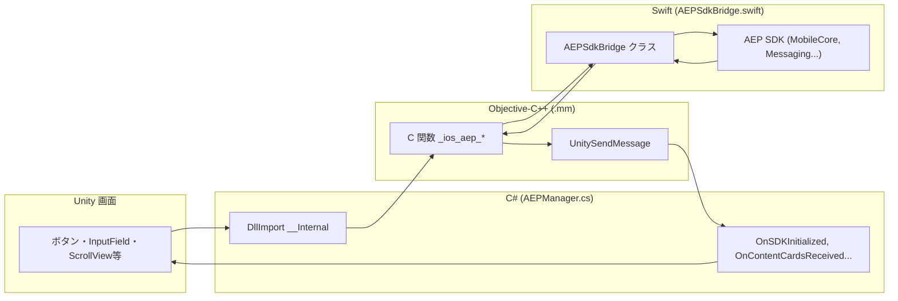
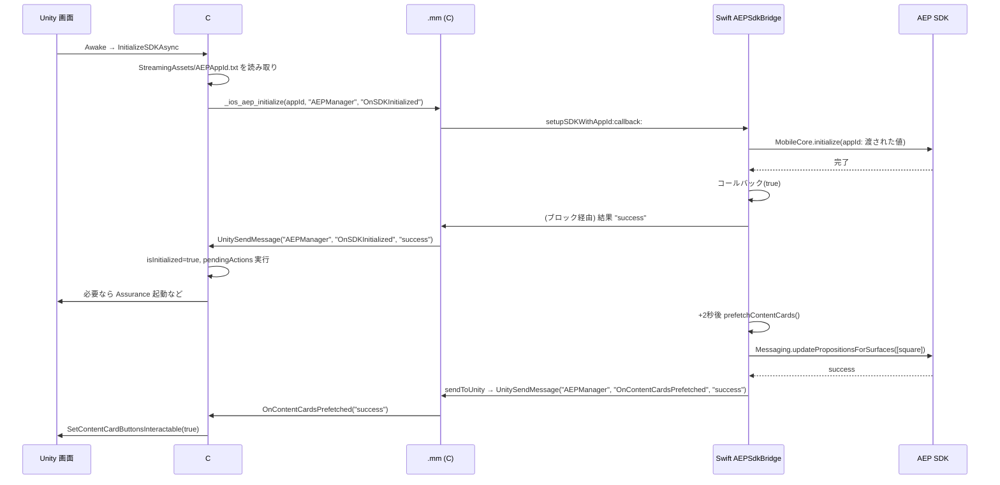
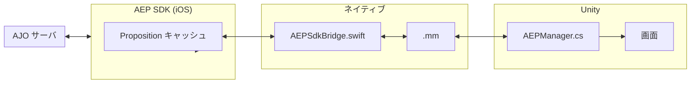
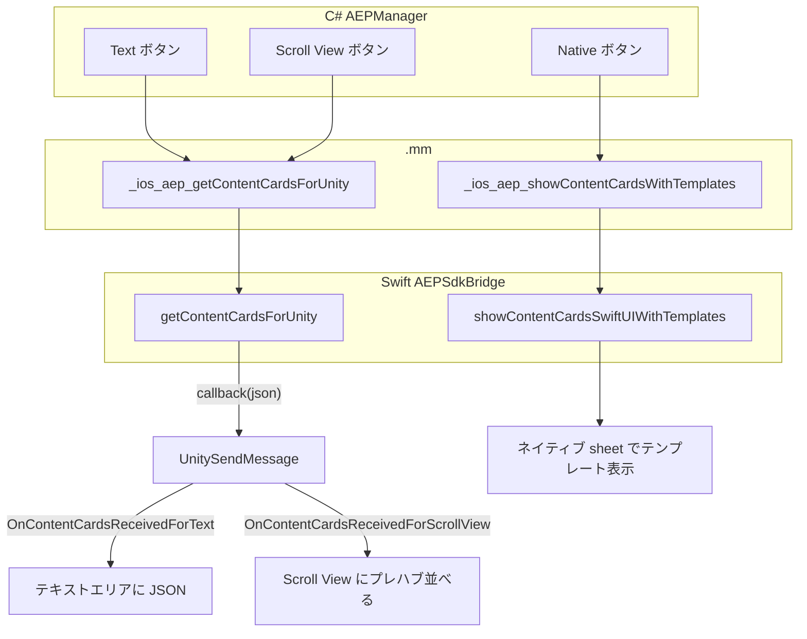
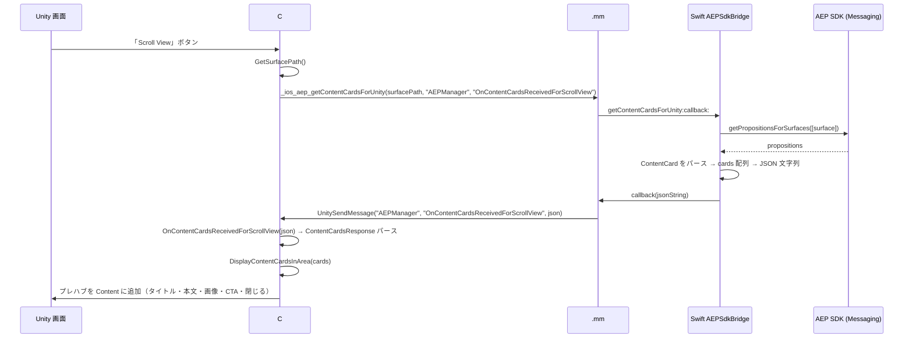
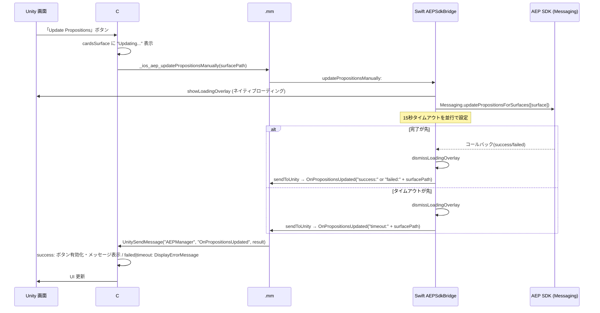

# AEP SDK Test

Unity で **iOS / Android** ビルドし、AEP SDK / AJO Content Cards / In-App Message を扱うサンプル。ネイティブブリッジ経由で AEP を呼び出す。技術的精査は[技術的精査](#技術的精査)を参照。

## まず動かす（クローン直後の最短手順）

### 結論

- **Unity アプリをビルドして起動するだけ**なら、クローン直後でも可能です（AEP 未初期化のまま動作）。
- **AEP の初期化 / Content Cards / In-App Message まで確認する**には、Adobe Tags（旧 Launch）の **App ID 設定が必須**です。
- このプロジェクトの動作確認シーンは `**Assets/First Scene.unity`（First Scene）** です。

### 1) リポジトリを取得

```bash
git clone https://github.com/noriinoue/AEP-SDK-Test
cd AEP-SDK-Test
```

### 2) Unity で開く

- 推奨 Unity バージョン: `6000.3.6f1`（`ProjectSettings/ProjectVersion.txt`）
- Unity Hub でプロジェクトを開く
- 起動直後に別シーンが開いている場合は、`Assets/First Scene.unity` を開いて動作確認してください

### 3) AEP App ID（Adobe Tags / Launch）を設定

1. `Assets/StreamingAssets/AEPAppId.txt.sample` を `AEPAppId.txt` にコピー
2. `AEPAppId.txt` の `YOUR_LAUNCH_APP_ID_HERE` を、Adobe Tags の App ID（例: `xxxx/xxxx/launch-xxxx-development`）に置換
3. `AEPAppId.txt` は `.gitignore` 対象のためコミットしない

> App ID が未設定だと、起動時に AEP 初期化が失敗し、関連機能（Content Cards / In-App Message）を確認できません。

### 4) ビルド

- **iOS**: Unity で iOS Build → Xcode で実機起動
- **Android**: Unity で Android に切替 → `External Dependency Manager > Android Resolver > Resolve` → Build / Build And Run

---

## 目次

1. [まず動かす（クローン直後の最短手順）](#まず動かすクローン直後の最短手順)
2. [プロジェクト概要](#プロジェクト概要)
3. [セットアップ（AEP App ID）](#セットアップaep-app-id)
4. [実装状態の詳細（iOS）](#実装状態の詳細-ios)
5. [実装状態の詳細（Android）](#実装状態の詳細-android)
6. [AJO Content Cards の実装](#ajo-content-cards-の実装)
7. [AJO In-App Message](#ajo-in-app-message)
8. [動作環境・ビルド](#動作環境ビルド)
9. [技術的精査](#技術的精査)

---

## プロジェクト概要

- **プラットフォーム**: Unity → **iOS** および **Android**（ネイティブブリッジで各 SDK を呼び出し）
- **機能**
  - AEP SDK 初期化（非同期、コールバックで完了通知）
  - Edge イベント送信、Identity 更新（extendedPersonalId 等）
  - **Content Cards**: 3 種の表示（Text / Native / Scroll View）※ Android の Native はログのみ・Scroll View で表示する運用
  - **In-App Message**: ボタン押下時の挙動（URL スキームまたは MessagingDelegate で Unity 通知）
  - Proposition 手動更新（完了・失敗・タイムアウトを Unity に通知）
  - Assurance 手動起動（デバッグ用、オプションで起動時自動起動）

---

## セットアップ（AEP App ID）

iOS ビルドで AEP SDK を初期化するには **Launch の App ID** が必要です。この値はリポジトリに含めず、各環境で設定します。

1. **サンプルをコピー**
  `Assets/StreamingAssets/AEPAppId.txt.sample` を `AEPAppId.txt` にコピーする。
2. **App ID を記入**
  `AEPAppId.txt` を開き、`YOUR_LAUNCH_APP_ID_HERE` を Adobe Launch の App ID（例: `xxxx/xxxx/launch-xxxx-development`）に置き換える。
3. **コミットしない**
  `AEPAppId.txt` は `.gitignore` で除外されているため、そのままコミットされません。

初回クローン時や CI では、上記のとおり `AEPAppId.txt` を用意してから iOS ビルドしてください。未設定の場合は初期化が失敗し、Unity のコンソールにエラーが表示されます。

---

## 実装状態の詳細（iOS）

### ファイル構成と役割


| レイヤー            | ファイル                                    | 役割                                                                                       |
| --------------- | --------------------------------------- | ---------------------------------------------------------------------------------------- |
| Unity (C#)      | `Assets/Scripts/AEPManager.cs`          | エントリポイント。SDK 初期化・イベント・Identity・Content Cards の UI とネイティブ呼び出し。シングルトン、初期化完了まで操作をキューイング。    |
| iOS ブリッジ (ObjC) | `Assets/Plugins/iOS/AEPSdkBridge.mm`    | C 関数として Unity の `DllImport` と対応。Swift の `AEPSdkBridge` およびコールバック・`UnitySendMessage` の仲介。 |
| iOS 実装 (Swift)  | `Assets/Plugins/iOS/AEPSdkBridge.swift` | AEP 各拡張の呼び出し、Content Cards の取得・テンプレート表示、Proposition 更新、ローディング/エラー表示、Unity への通知。          |


### レイヤーと呼び出し関係

- **Unity → ネイティブ**: 画面操作 → C# → .mm → Swift → AEP SDK
- **ネイティブ → Unity**: Swift コールバック / `sendToUnity` → .mm の `UnitySendMessage` → C# の `OnXxx(string)` で UI 更新




#### 構成の理由

- **C# からネイティブ**: Unity iOS では **C ABI の関数を `DllImport("__Internal")` で呼ぶ**形式のみサポート。Swift/ObjC を直接呼べないため、C の入り口が必要。
- **.mm を挟む**: `.mm` で `extern "C"` により C リンケージの関数を定義し、その中で Swift の `AEPSdkBridge` を呼ぶ。Swift は `@objc` と `UnityFramework-Swift.h` で ObjC から呼び出し可能。経路は C# → C 関数 → Swift。
- **ネイティブ → Unity**: 戻りは `**UnitySendMessage(objectName, methodName, message)` のみ**。非同期結果は Swift のコールバック内、または .mm のブロック内で `UnitySendMessage` を呼んで C# に渡す。

→ **呼び出しは C 関数のみ・戻りは UnitySendMessage のみ**という iOS ブリッジ仕様のため、C の入り口を持つ .mm と Swift の 2 段構成にしている。

### 初期化フロー




1. `AEPManager.Awake` → `InitializeSDKAsync`
2. iOS: `_ios_aep_initialize` → .mm → `AEPSdkBridge.setupSDK(callback:)`
3. Swift: `MobileCore.initialize` 完了 → コールバックで `UnitySendMessage` → `OnSDKInitialized("success")`
4. Unity: `isInitialized = true`、`pendingActions` を実行。設定で有効なら `StartAssuranceSessionAsync`
5. Swift: 初期化完了から約 2 秒後に `prefetchContentCards()`（Surface `"square"`）。成功時 `OnContentCardsPrefetched("success")` で Unity に通知 → Content Cards ボタン有効化

### ネイティブブリッジ一覧（C# ↔ C ↔ Swift）


| メソッド                                                                                                                                               | 用途                                               |
| -------------------------------------------------------------------------------------------------------------------------------------------------- | ------------------------------------------------ |
| C#:`_ios_aep_initialize` C:`_ios_aep_initialize` Swift:`setupSDKWithCallback:`                                                                     | 非同期初期化、完了時コールバック名で Unity に通知                     |
| C#:`_ios_aep_startAssurance` C:`_ios_aep_startAssurance` Swift:`startAssuranceSession`                                                             | Assurance 手動起動                                   |
| C#:`_ios_aep_sendEvent` C:`_ios_aep_sendEvent` Swift:`sendEvent:jsonData:`                                                                         | Edge イベント送信                                      |
| C#:`_ios_aep_updateIdentities` C:`_ios_aep_updateIdentities` Swift:`updateIdentities:identifier:`                                                  | Identity 更新                                      |
| C#:`_ios_aep_getContentCardsForUnity` C:`_ios_aep_getContentCardsForUnity` Swift:`getContentCardsForUnity:callback:`                               | カード JSON 取得、コールバックで Unity に文字列渡し                 |
| C#:`_ios_aep_showContentCardsWithTemplates` C:`_ios_aep_showContentCardsWithTemplates` Swift:`showContentCardsSwiftUIWithTemplates:templateStyle:` | ネイティブドロワーでテンプレート表示                               |
| C#:`_ios_aep_updatePropositionsManually` C:`_ios_aep_updatePropositionsManually` Swift:`updatePropositionsManually:`                               | Proposition 手動更新、完了は `OnPropositionsUpdated` で通知 |


### Unity 側の主要状態

- **シングルトン**: `AEPManager` は `DontDestroyOnLoad` で 1 インスタンス
- **初期化待ち**: `ExecuteWhenInitialized(action)` — 未初期化時は `pendingActions` に積み、完了後に実行
- **Content Cards ボタン**: `OnContentCardsPrefetched` / `OnPropositionsUpdated` 成功時に `SetContentCardButtonsInteractable(true)` で有効化

### データ構造（Unity ↔ ネイティブ）

- **ContentCardData** (C#): `templateType`, `title`, `body`, `imageUrl`, `actionUrl`, `buttonText` — ネイティブ JSON の 1 枚分
- **ContentCardsResponse** (C#): `cards` (List), `error` — `getContentCardsForUnity` コールバックのデシリアライズ先

---

## 実装状態の詳細（Android）

- **レイヤー**: Unity (C#) → `AndroidJavaClass("com.adobe.aep.unity.AEPSdkBridge")` → Java (AEPSdkBridge.java) → AEP Android SDK。結果は `UnityPlayer.UnitySendMessage(gameObjectName, methodName, message)` で Unity に渡す。
- **ファイル**: `Assets/Scripts/AEPManager.cs`（`#if UNITY_ANDROID && !UNITY_EDITOR`）、`Assets/Plugins/Android/com/adobe/aep/unity/AEPSdkBridge.java`、`Assets/AEPSDK/Editor/AEPSDKDependencies.xml`（`<androidPackages>` で AEP を定義）、`mainTemplate.gradle`（EDM が Resolve 時に XML を読んで implementation を挿入）。
- **初期化**: `AEPManager.Awake` → `LoadAEPAppIdAndInitialize()` で `AEPAppId.txt` を読み取り → `CallStatic("initialize", appId, "AEPManager", "OnSDKInitialized")`。Java 側で `MobileCore.initialize(UnityPlayer.currentActivity.getApplicationContext())` 完了後、Handler 経由で `UnitySendMessage`。**In-App 表示にはカスタム Application（AEPApplication）での Application.onCreate からの初期化を推奨**（[InAppMessage.md](InAppMessage.md) 参照）。
- **注意**: `UnityPlayer.currentActivity` はフィールド。Content Card 判定は `item.getSchema() == SchemaType.CONTENT_CARD`。Edge.sendEvent の第 2 引数に EdgeCallback が必要な場合は `Edge.sendEvent(event, null)`。Identity は `com.adobe.marketing.mobile.edge.identity.Identity.updateIdentities(map)`。
- **Content Cards（Android）**: Text / Scroll View は `getContentCardsForUnity` で JSON 取得。Native は未実装（ログのみ、Scroll View で表示する運用）。Proposition 手動更新は `updatePropositionsManually` → `OnPropositionsUpdated` で success/failed/timeout を通知。
- **ビルド**: Build Settings で Android を選択 → **Assets → External Dependency Manager → Android Resolver → Resolve** → Build / Build And Run。エミュレータでは Target Architectures に x86/x86_64 を入れておく。

---

## AJO Content Cards の実装

AJO Content Cards の概要と実装の対応関係をまとめた章。

### 概要

- **AJO** で配信する **Content Cards** を Unity 内で表示する実装
- カードの中身（タイトル・本文・画像・CTA 等）は AJO の施策で決定。Surface ごとに Proposition としてキャッシュ
- 本プロジェクト: **Surface 1 つ**（未入力時 `"square"`）に対して **3 種の表示**（Text / Native / Scroll View）

### 用語の整理


| 用語               | 説明                                                                                                                                 |
| ---------------- | ---------------------------------------------------------------------------------------------------------------------------------- |
| **Surface**      | 配信場所を識別するパス（例: `"square"`）。iOS では内部で `mobileapp://<bundleId>/path` の URI になる。AJO で設定した Surface と一致させる。                             |
| **Proposition**  | Surface に紐づく「どのカードを出すか」の情報。SDK がキャッシュし、`getPropositionsForSurfaces` で取得。ネイティブテンプレート表示には `getContentCardsUI` で ContentCardUI を取得する。 |
| **Content Card** | 1 枚分のカードデータ（スキーマは `ContentCardSchemaData`）。AJO の title/body/image/buttons 等のネスト構造を持つ。                                              |
| **テンプレート**       | ネイティブ表示用。AJO の施策に応じて Large / Small / ImageOnly などが選ばれ、SDK の `getContentCardsUI(for:customizer:listener:)` でビューが生成される。              |


### 実装イメージ（全体）




- **Proposition キャッシュ**: 起動後の prefetch（surface: `"square"`）と手動更新で再取得
- **取得**: ネイティブで `Messaging.getPropositionsForSurfaces([surface])` または `Messaging.getContentCardsUI(for:surface, ...)`
- **Unity へ**: Proposition をパースして JSON にし、`getContentCardsForUnity` のコールバックで返す。.mm が `UnitySendMessage(gameObject, methodName, json)` で渡す
- **ネイティブ表示**: `getContentCardsUI` の `ContentCardUI.view` を SwiftUI ScrollView に並べ、sheet で表示

### Surface の扱い

- **Unity**: `surfaceInputField` で入力。空欄/未設定時は `GetSurfacePath()` → `"square"`
- **ネイティブ**: 受け取った `surfacePath` で `Surface(path: surfacePath)` を生成し、Content Cards API に渡す

### 3 つの表示方法




| 表示              | 説明                                 | Unity 側                                                                                                                                                                                                                    | ネイティブ側                                                                                                                                                                                                                        |
| --------------- | ---------------------------------- | -------------------------------------------------------------------------------------------------------------------------------------------------------------------------------------------------------------------------- | ----------------------------------------------------------------------------------------------------------------------------------------------------------------------------------------------------------------------------- |
| **Text**        | 取得したカードを JSON としてログ風エリアに表示         | `ShowContentCardsText` → `_ios_aep_getContentCardsForUnity(..., "OnContentCardsReceivedForText")`。コールバックで `cardsSurface` の TMP_Text に PrettyPrintJson を表示。                                                                 | `getContentCardsForUnity` で Proposition をパースし、`cards` 配列の JSON 文字列をコールバックで返す。                                                                                                                                                 |
| **Native**      | SDK のテンプレート通りにネイティブのドロワーで表示        | `ShowContentCardsNative` → `_ios_aep_showContentCardsWithTemplates(surfacePath, "large")`。表示はすべてネイティブ。                                                                                                                     | `showContentCardsSwiftUIWithTemplates` で SwiftUI の sheet を表示。`ContentCardsSwiftUIView` が `getContentCardsUI(for:customizer:listener:)` を呼び、得た `ContentCardUI` の `view` を ScrollView に並べる。Large/Small/ImageOnly は AJO の施策で決まる。 |
| **Scroll View** | 同一画面の Scroll View に、Unity のプレハブで表示 | `ShowContentCardsScrollView` → `_ios_aep_getContentCardsForUnity(..., "OnContentCardsReceivedForScrollView")`。コールバックで `ContentCardsResponse` をパースし、`DisplayContentCardsInArea(cards)` で `contentCardsContainer` にプレハブを並べる。 | Text と同じく `getContentCardsForUnity` で JSON を返す。                                                                                                                                                                               |


### データフロー（Scroll View の例）




1. ユーザーが「Scroll View」ボタンを押す
2. C#: `GetSurfacePath()` → `_ios_aep_getContentCardsForUnity(surfacePath, "AEPManager", "OnContentCardsReceivedForScrollView")`
3. Swift: `Messaging.getPropositionsForSurfaces([surface])` でキャッシュ取得。`items` のうち `schema == .contentCard` を `ContentCardSchemaData` でパース
4. AJO のネスト（`title.content`, `body.content`, `image.url`, `buttons[0].actionUrl` 等）をフラット化 → `cards` 配列を JSON 化してコールバックで返す
5. .mm: コールバックで受け取った JSON を `UnitySendMessage(..., "OnContentCardsReceivedForScrollView", json)` で Unity に渡す
6. C#: `OnContentCardsReceivedForScrollView(json)` で `ContentCardsResponse` にデシリアライズ。`DisplayContentCardsInArea(response.cards)` で既存の子を破棄し、各 `ContentCardData` で `contentCardItemPrefab` をインスタンス化して `contentCardsContainer` に追加（タイトル・本文・画像・CTA・閉じるをバインド）

### プレハブ仕様（Scroll View 用）

- **親**: `contentCardsContainer` = Scroll View の Content（Canvas → Scroll View → Viewport → Content）
- **プレハブ** `contentCardItemPrefab` 推奨構成:
  - 子: **RawImage**（画像）、**TMP_Text** x2（タイトル・本文）、**Button**（CTA）
  - 任意: 名前が `"CloseButton"` または `"Close"` を含む **Button** → 押下でそのカードの GameObject を Destroy（Inspector の On Click 不要）
  - 枠: ルートに **Image**（枠用スプライト）または **Outline**
- **レイアウト**: 各インスタンスに `LayoutElement`（preferredHeight 120, minHeight 80, flexibleWidth 1）。RawImage は preferredWidth/Height 80。そのまま Scroll View 内に並ぶ

### ネイティブ側の実装ポイント（Swift）

- **getContentCardsForUnity**: `ContentCardSchemaData.content` を `[String: Any]` で扱い、`title.content` / `body.content` / `image.url` / `buttons[0].actionUrl` 等を取得。表示トラッキングは `contentCardSchemaData.track(withEdgeEventType: .display)`
- **showContentCardsSwiftUIWithTemplates**: `ContentCardsSwiftUIView` が `getContentCardsUI(for:customizer:listener:)` を呼ぶ。`ContentCardCustomizerForBridge` で Large/Small/ImageOnly を統一。`ContentCardListenerForBridge` で表示・閉じる・タップを処理
- **Unity 通知**: `sendToUnity(objectName:method:message:)` で `OnContentCardsPrefetched` / `OnPropositionsUpdated`。手動更新はローディング表示 → 15 秒タイムアウト or 完了で `success:` / `failed:` / `timeout:` + surfacePath を送る

### Proposition の手動更新




- **Unity**: 「Update Propositions」→ `UpdatePropositionsManually` → `_ios_aep_updatePropositionsManually(surfacePath)`
- **Swift**: `showLoadingOverlay` → `Messaging.updatePropositionsForSurfaces([surface])`。15 秒タイムアウト or 完了で `dismissLoadingOverlay`、`OnPropositionsUpdated("success|failed|timeout:" + surfacePath)` で通知
- **Unity**: `OnPropositionsUpdated` — success 時はボタン有効化・メッセージ表示、failed/timeout 時は `DisplayErrorMessage`

---

## AJO In-App Message

画面に表示した AJO の In-App Message のボタン押下挙動・Unity/Android の Activity 設定・実装チェックは **[InAppMessage.md](InAppMessage.md)** にまとめてある。

- **方法 A（推奨・コード不要）**: ボタン URL を `adbinapp://dismiss?interaction=...&link=...` にすると、SDK が閉じる・トラッキング・リンクを処理する。
- **アプリ内 WebView**: MessagingDelegate で WKWebView のナビゲーションをインターセプトし、link をアプリ内 WebView で開く（InAppMessage.md の「方法 B」）。
- **方法 C（JS 連携）**: handleJavascriptMessage と postMessage で Unity の `AEPManager.OnInAppMessageAction(string)` に渡す。Android では `window.AEPInAppCallback` で分岐。

---

## 動作環境・ビルド

- **iOS**: Unity で iOS ビルド → Xcode で開く。Swift/ObjC ブリッジと AEP 系 CocoaPods がリンクされている前提。初期化用 Launch App ID は必要に応じて差し替える。
- **Android**: Build Settings で Android を選択 → **External Dependency Manager → Android Resolver → Resolve** → Build / Build And Run。In-App 利用時は GameActivity とカスタム Application（AEPApplication）の有効化を推奨（[InAppMessage.md](InAppMessage.md) 参照）。

---

## 技術的精査

実施日: 2025-02-09。Unity 公式・Adobe AEP/AJO 公式ドキュメントおよび Web 検索による裏付け。

- **Unity iOS ブリッジ**: C ABI の `DllImport("__Internal")`、`extern "C"`、ネイティブ→Unity は `UnitySendMessage` のみ — 公式仕様と一致。
- **AEP SDK**: MobileCore.initialize、Messaging.updatePropositionsForSurfaces / getPropositionsForSurfaces、getContentCardsUI、Surface(path:)、ContentCardSchemaData、Assurance — 公式 API と一致。
- **AJO 用語**: Surface（配信場所のパス/URI）、Proposition（キャッシュ）、Content Card（ContentCardSchemaData）、テンプレート（Large/Small/ImageOnly）— 公式説明と矛盾なし。
- **補足**: Proposition の実体は getPropositionsForSurfaces で取得。getContentCardsUI は表示用 UI オブジェクトの取得。Surface は内部で `mobileapp://<bundleId>/path` 形式。updatePropositionsForSurfaces の完了は公式の完了ハンドラで検知。

