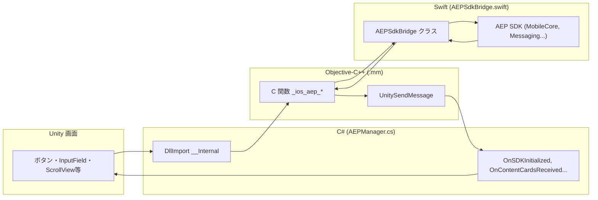
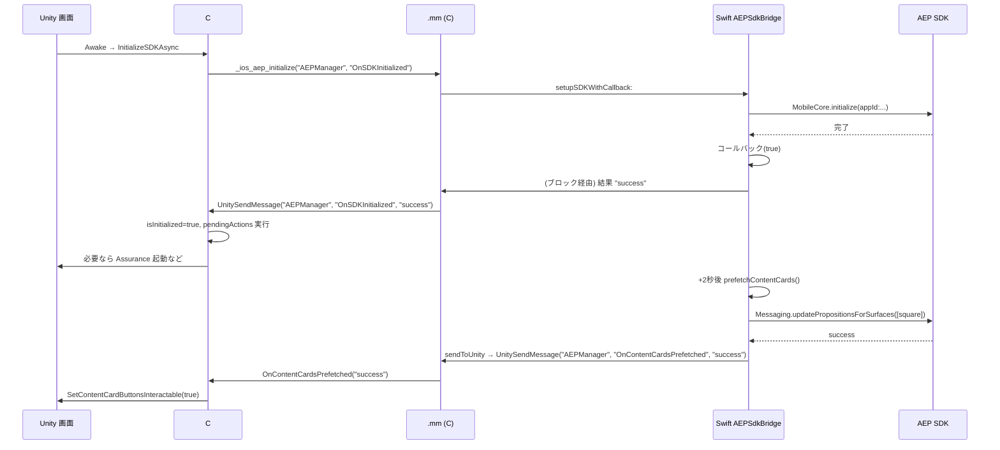
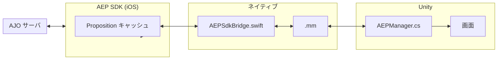
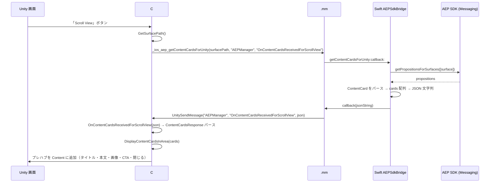
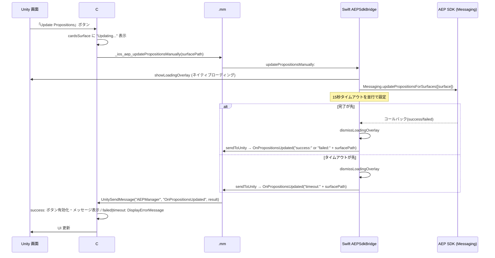

# AEP SDK Test

Unity iOS アプリで Adobe Experience Platform (AEP) SDK および Adobe Journey Optimizer (AJO) のコンテンツカードを利用するサンプルプロジェクトです。

---

## 目次

1. [プロジェクト概要](#プロジェクト概要)
2. [実装状態の詳細](#実装状態の詳細)
3. [AJO Content Cards の実装](#ajo-content-cards-の実装)

---

## プロジェクト概要

- **プラットフォーム**: Unity → iOS ビルド（ネイティブブリッジ経由で AEP SDK を呼び出し）
- **主な機能**
  - AEP SDK の初期化（非同期、コールバックで完了通知）
  - イベント送信（Edge）、Identity 更新（extendedPersonalId 等）
  - **Content Cards**: 3 通りの表示（Text / Native / Scroll View）
  - Proposition の手動更新（完了・失敗・タイムアウトを Unity に通知）
  - Assurance の手動起動（デバッグ用、オプションで起動時自動起動）

---

## 実装状態の詳細

### ファイル構成と役割

| レイヤー | ファイル | 役割 |
|--------|---------|------|
| Unity (C#) | `Assets/Scripts/AEPManager.cs` | エントリポイント。SDK 初期化・イベント・Identity・Content Cards の UI とネイティブ呼び出し。シングルトン、初期化完了まで操作をキューイング。 |
| iOS ブリッジ (ObjC) | `Assets/Plugins/iOS/AEPSdkBridge.mm` | C 関数として Unity の `DllImport` と対応。Swift の `AEPSdkBridge` およびコールバック・`UnitySendMessage` の仲介。 |
| iOS 実装 (Swift) | `Assets/Plugins/iOS/AEPSdkBridge.swift` | AEP 各拡張の呼び出し、Content Cards の取得・テンプレート表示、Proposition 更新、ローディング/エラー表示、Unity への通知。 |

### レイヤーと呼び出し関係

Unity 画面の操作が C# → .mm → Swift と渡り、コールバックは Swift → .mm → C#（UnitySendMessage）で返る関係です。

#### なぜこの構成にする必要があるか

- **C# からネイティブを呼ぶには C の関数が必須**  
  Unity の iOS ビルドでは、ネイティブコード呼び出しは「**C ABI の関数を `DllImport("__Internal")` で呼ぶ**」形だけが公式にサポートされています。C# から Swift や Objective-C のメソッドを直接呼ぶことはできません。

- **.mm（Objective-C++）を挟む理由**  
  C の関数をどこかで定義する必要があります。Objective-C++ ファイル（.mm）で `extern "C"` により **C リンケージの関数**を定義し、その中で Swift の `AEPSdkBridge` を呼び出しています。Swift は `@objc` と自動生成ヘッダ（`UnityFramework-Swift.h`）で Objective-C から呼び出せる形になっており、.mm がそのヘッダを import して Swift を呼びます。結果として「C# → C 関数 → Swift」という経路になります。

- **ネイティブから Unity に戻す方法**  
  Unity が提供しているのは、ネイティブから C# に戻すための **C API の `UnitySendMessage(オブジェクト名, メソッド名, メッセージ文字列)` だけ**です。ネイティブ側（Swift または .mm）でこの C 関数を呼ぶと、Unity が指定した GameObject の指定メソッドを、引数 1 つ（string）で実行します。そのため、非同期の結果は「Swift でコールバックを受け取り、その中で `UnitySendMessage` を呼ぶ」か「.mm のブロック内で `UnitySendMessage` を呼ぶ」形で C# に返しています。

まとめると、**Unity の iOS ブリッジ仕様（呼び出しは C 関数のみ・戻りは UnitySendMessage のみ）に合わせるために、C の入り口を持つ .mm と、そこで呼ばれる Swift の 2 段構成**にしています。



- **呼び出し方向（Unity → ネイティブ）**: 画面操作 → C# の `_ios_aep_*` 呼び出し → .mm の C 関数 → Swift の `AEPSdkBridge` → AEP SDK。
- **戻り方向（ネイティブ → Unity）**: Swift でコールバック or `sendToUnity` → .mm の `UnitySendMessage(gameObject, methodName, message)` → C# の `OnXxx(string)` が呼ばれ、UI を更新。

### 初期化フロー



1. `AEPManager.Awake` で `InitializeSDKAsync` を開始。
2. iOS 実機時: `_ios_aep_initialize` → `.mm` → `AEPSdkBridge.setupSDK(callback:)`。
3. Swift で `MobileCore.initialize` 完了後、コールバックで `UnitySendMessage` により `OnSDKInitialized("success")` を呼ぶ。
4. Unity で `isInitialized = true` とし、`pendingActions` を順次実行。設定で有効なら `StartAssuranceSessionAsync` を実行。
5. Swift は初期化完了約 2 秒後に `prefetchContentCards()` で Surface `"square"` をプリフェッチし、成功時に `OnContentCardsPrefetched("success")` で Unity に通知。Unity は Content Cards 用ボタンを有効化。

### ネイティブブリッジ一覧（C# ↔ C ↔ Swift）

| C# の DllImport | .mm の C 関数 | Swift メソッド | 用途 |
|-----------------|----------------|----------------|------|
| `_ios_aep_initialize` | `_ios_aep_initialize` | `setupSDKWithCallback:` | 非同期初期化、完了時コールバック名で Unity に通知 |
| `_ios_aep_startAssurance` | `_ios_aep_startAssurance` | `startAssuranceSession` | Assurance 手動起動 |
| `_ios_aep_sendEvent` | `_ios_aep_sendEvent` | `sendEvent:jsonData:` | Edge イベント送信 |
| `_ios_aep_updateIdentities` | `_ios_aep_updateIdentities` | `updateIdentities:identifier:` | Identity 更新 |
| `_ios_aep_getContentCardsForUnity` | `_ios_aep_getContentCardsForUnity` | `getContentCardsForUnity:callback:` | カード JSON 取得、コールバックで Unity に文字列渡し |
| `_ios_aep_showContentCardsWithTemplates` | `_ios_aep_showContentCardsWithTemplates` | `showContentCardsSwiftUIWithTemplates:templateStyle:` | ネイティブドロワーでテンプレート表示 |
| `_ios_aep_updatePropositionsManually` | `_ios_aep_updatePropositionsManually` | `updatePropositionsManually:` | Proposition 手動更新、完了は `OnPropositionsUpdated` で通知 |

### Unity 側の主要状態

- **シングルトン**: `AEPManager` は `DontDestroyOnLoad` で 1 インスタンスのみ。
- **初期化待ち**: `ExecuteWhenInitialized(action)` で、未初期化時は `pendingActions` に積み、初期化完了後に実行。
- **Content Cards ボタン**: `OnContentCardsPrefetched` と `OnPropositionsUpdated` 成功時に `SetContentCardButtonsInteractable(true)` で一括有効化。

### データ構造（Unity ↔ ネイティブ）

- **ContentCardData** (C#): `templateType`, `title`, `body`, `imageUrl`, `actionUrl`, `buttonText`。ネイティブから受け取る JSON の 1 枚分に相当。
- **ContentCardsResponse** (C#): `cards` (List<ContentCardData>), `error`。`getContentCardsForUnity` のコールバックで渡す JSON のデシリアライズ先。

---

## AJO Content Cards の実装

この章だけでも、AJO Content Cards の概要と実装イメージが把握できるようにまとめています。

### 概要

- **AJO (Adobe Journey Optimizer)** で配信する **Content Cards** を、Unity アプリ内で表示する実装です。
- カードの「中身」（タイトル・本文・画像・CTA 等）は **AJO の施策**で決まり、Surface ごとに Proposition としてキャッシュされます。
- 本プロジェクトでは **1 つの Surface 入力**（未入力時は `"square"`）に対し、**3 とおりの表示方法**を用意しています。

### 用語の整理

| 用語 | 説明 |
|------|------|
| **Surface** | 配信場所を識別するパス（例: `"square"`）。AJO で設定した Surface と一致させる。 |
| **Proposition** | Surface に紐づく「どのカードを出すか」の情報。SDK がキャッシュし、`getPropositionsForSurfaces` / `getContentCardsUI` で取得。 |
| **Content Card** | 1 枚分のカードデータ（スキーマは `ContentCardSchemaData`）。AJO の title/body/image/buttons 等のネスト構造を持つ。 |
| **テンプレート** | ネイティブ表示用。AJO の施策に応じて Large / Small / ImageOnly などが選ばれ、SDK の `getContentCardsUI(for:customizer:listener:)` でビューが生成される。 |

### 実装イメージ（全体）



- **Proposition キャッシュ**: 起動後の prefetch（surface: `"square"`）および手動更新で再取得。
- **取得**: ネイティブで `Messaging.getPropositionsForSurfaces([surface])` または `Messaging.getContentCardsUI(for:surface, ...)` を使用。
- **Unity へ渡す場合**: Proposition をパースして JSON にし、`getContentCardsForUnity` のコールバックで文字列を返す。`.mm` が `UnitySendMessage(gameObject, methodName, json)` で Unity に渡す。
- **ネイティブで表示する場合**: `getContentCardsUI` で得た `ContentCardUI` の `view` を SwiftUI の ScrollView に並べ、ドロワー（sheet）で表示。

### Surface の扱い

- Unity: `surfaceInputField` で入力。空欄または未設定時は `GetSurfacePath()` が `"square"` を返す。
- ネイティブ: 受け取った `surfacePath` で `Surface(path: surfacePath)` を生成し、すべての Content Cards API に渡す。

### 3 つの表示方法

```mermaid
flowchart TB
    subgraph Unity["C# AEPManager"]
        B1[Text ボタン]
        B2[Native ボタン]
        B3[Scroll View ボタン]
    end
    
    subgraph MM[".mm"]
        M1[_ios_aep_getContentCardsForUnity]
        M2[_ios_aep_showContentCardsWithTemplates]
    end
    
    subgraph Swift["Swift AEPSdkBridge"]
        S1[getContentCardsForUnity]
        S2[showContentCardsSwiftUIWithTemplates]
    end
    
    B1 --> M1
    B3 --> M1
    B2 --> M2
    
    M1 --> S1
    M2 --> S2
    
    S1 -->|callback(json)| MM2[UnitySendMessage]
    MM2 -->|OnContentCardsReceivedForText| C1[テキストエリアに JSON]
    MM2 -->|OnContentCardsReceivedForScrollView| C2[Scroll View にプレハブ並べる]
    S2 --> C3[ネイティブ sheet でテンプレート表示]
```

| 表示 | 説明 | Unity 側 | ネイティブ側 |
|------|------|----------|--------------|
| **Text** | 取得したカードを JSON としてログ風エリアに表示 | `ShowContentCardsText` → `_ios_aep_getContentCardsForUnity(..., "OnContentCardsReceivedForText")`。コールバックで `cardsSurface` の TMP_Text に PrettyPrintJson を表示。 | `getContentCardsForUnity` で Proposition をパースし、`cards` 配列の JSON 文字列をコールバックで返す。 |
| **Native** | SDK のテンプレート通りにネイティブのドロワーで表示 | `ShowContentCardsNative` → `_ios_aep_showContentCardsWithTemplates(surfacePath, "large")`。表示はすべてネイティブ。 | `showContentCardsSwiftUIWithTemplates` で SwiftUI の sheet を表示。`ContentCardsSwiftUIView` が `getContentCardsUI(for:customizer:listener:)` を呼び、得た `ContentCardUI` の `view` を ScrollView に並べる。Large/Small/ImageOnly は AJO の施策で決まる。 |
| **Scroll View** | 同一画面の Scroll View に、Unity のプレハブで表示 | `ShowContentCardsScrollView` → `_ios_aep_getContentCardsForUnity(..., "OnContentCardsReceivedForScrollView")`。コールバックで `ContentCardsResponse` をパースし、`DisplayContentCardsInArea(cards)` で `contentCardsContainer` にプレハブを並べる。 | Text と同じく `getContentCardsForUnity` で JSON を返す。 |

### データフロー（Scroll View の例）



1. ユーザーが「Scroll View」ボタンを押す。
2. C#: `GetSurfacePath()` → `_ios_aep_getContentCardsForUnity(surfacePath, "AEPManager", "OnContentCardsReceivedForScrollView")`。
3. Swift: `Messaging.getPropositionsForSurfaces([surface])` でキャッシュから取得。各 Proposition の `items` のうち `schema == .contentCard` を `ContentCardSchemaData` でパース。
4. AJO のネスト構造（`title.content`, `body.content`, `image.url`, `buttons[0].actionUrl`, `buttons[0].text.content` 等）をフラット化し、`cards` 配列を JSON 化してコールバックで返す。
5. .mm: コールバックで受け取った JSON を `UnitySendMessage("AEPManager", "OnContentCardsReceivedForScrollView", json)` で Unity に渡す。
6. C#: `OnContentCardsReceivedForScrollView(json)` で `ContentCardsResponse` にデシリアライズ。`DisplayContentCardsInArea(response.cards)` で既存の子を破棄し、各 `ContentCardData` に対して `contentCardItemPrefab` をインスタンス化して `contentCardsContainer` に追加。タイトル・本文・画像・CTA・閉じるボタンをバインド。

### プレハブ仕様（Scroll View 用）

- **親**: `contentCardsContainer` は **Scroll View の Content**（Canvas → Scroll View → Viewport → Content）を指定する。
- **プレハブ**（`contentCardItemPrefab`）の推奨構成:
  - 子に **RawImage**（画像）、**TMP_Text** を 2 つ（タイトル・本文）、**Button**（CTA）。
  - 任意で名前が `"CloseButton"` または `"Close"` を含む **Button** を置くと、押下でそのカードの GameObject が Destroy される（Inspector の On Click 不要）。
  - 枠: ルートに **Image**（枠用スプライト）または **Outline** で対応。
- **レイアウト**: 各インスタンスに `LayoutElement`（preferredHeight 120, minHeight 80, flexibleWidth 1）。RawImage には preferredWidth/Height 80 を設定。プレハブのレイアウトがそのまま Scroll View 内に並ぶ。

### ネイティブ側の実装ポイント（Swift）

- **getContentCardsForUnity**: `ContentCardSchemaData` の `content` を `[String: Any]` として扱い、`title.content` / `body.content` / `image.url` / `buttons[0].actionUrl` と `buttons[0].text.content` を取得。表示トラッキングは `contentCardSchemaData.track(withEdgeEventType: .display)` で送信。
- **showContentCardsSwiftUIWithTemplates**: `ContentCardsSwiftUIView` が `getContentCardsUI(for:customizer:listener:)` を呼び、`ContentCardCustomizerForBridge` で Large/Small/ImageOnly を統一スタイルに。`ContentCardListenerForBridge` で表示・閉じる・タップを処理し、閉じるで一覧から削除。
- **Unity への通知**: `sendToUnity(objectName:method:message:)` で `OnContentCardsPrefetched` / `OnPropositionsUpdated` を呼び出し。手動更新はローディング表示 → タイムアウト 15 秒または完了でローディングを閉じ、`success:` / `failed:` / `timeout:` + surfacePath を送る。

### Proposition の手動更新



- Unity: 「Update Propositions」ボタンで `UpdatePropositionsManually` → `_ios_aep_updatePropositionsManually(surfacePath)`。
- Swift: `showLoadingOverlay` → `Messaging.updatePropositionsForSurfaces([surface])`。15 秒タイムアウトと完了コールバックの両方で `dismissLoadingOverlay` し、`OnPropositionsUpdated("success|failed|timeout:" + surfacePath)` で Unity に通知。
- Unity: `OnPropositionsUpdated` で success 時はボタン有効化とメッセージ表示、failed/timeout 時は `DisplayErrorMessage`。

---

## 動作環境・ビルド

- Unity で iOS ビルドを行い、Xcode で開く。Swift と Objective-C のブリッジ、および AEP 系 CocoaPods がリンクされている前提です。
- 初期化用の Launch App ID は Swift 内でハードコードされています。必要に応じて差し替えてください。
