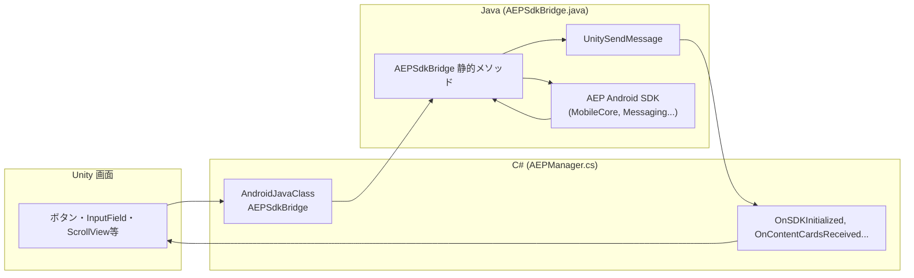
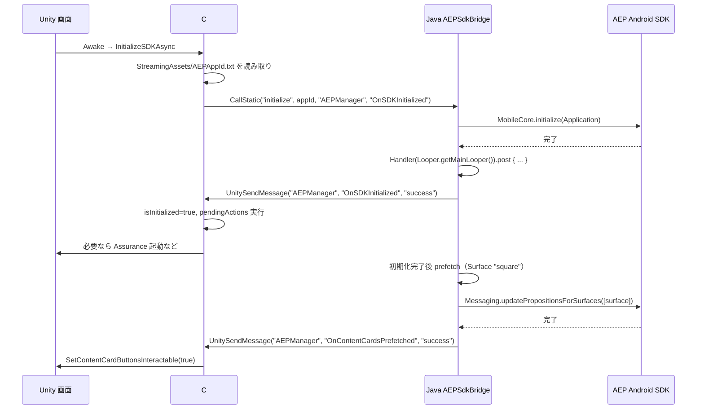
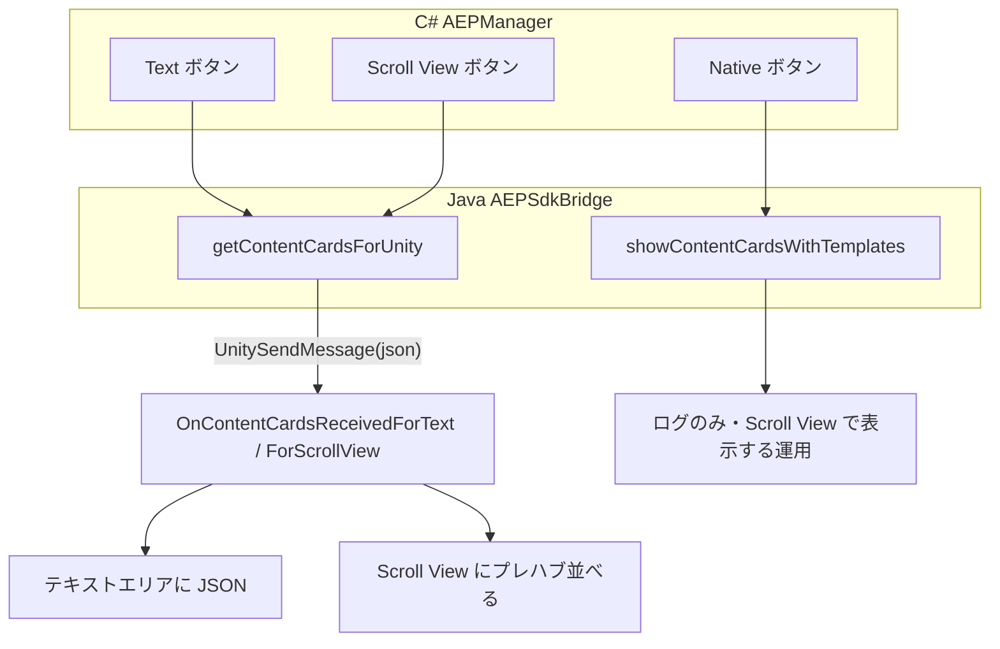
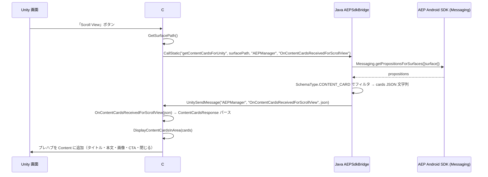
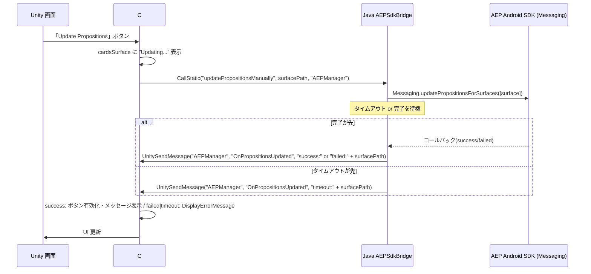

# AEP SDK Test — Android 版 README

Unity で **Android** ビルドし、AEP SDK / AJO Content Cards を扱うための手順と構成。ネイティブブリッジ（Java）経由で AEP Android SDK を呼び出す。**iOS とは別のブリッジ構成**（C# → AndroidJavaClass → Java → AEP）。

- メインの [README.md](README.md) は iOS 向け。本ドキュメントは **Android 単体**のセットアップ・ビルド・実装詳細。
- フロー図は本ドキュメント内に Mermaid で記載。一覧は [Docs/flow-diagrams.md](Docs/flow-diagrams.md) にもあり。

---

## 目次

1. [プロジェクト概要](#プロジェクト概要)
2. [セットアップ（AEP App ID）](#セットアップaep-app-id)
3. [実装状態の詳細](#実装状態の詳細)
4. [AJO Content Cards の実装](#ajo-content-cards-の実装android)
5. [ビルド・動作環境](#ビルド動作環境)

---

## プロジェクト概要

- **プラットフォーム**: Unity → **Android** のみ（本 README の対象）
- **機能**
  - AEP SDK 初期化（非同期、コールバックで完了通知）
  - Edge イベント送信、Identity 更新（extendedPersonalId 等）
  - **Content Cards**: Text / Scroll View で表示。Native は未実装（ログのみ、Scroll View で表示する運用）
  - Proposition 手動更新（完了・失敗・タイムアウトを Unity に通知）
  - Assurance 手動起動（デバッグ用）

---

## セットアップ（AEP App ID）

1. **サンプルをコピー**  
   `Assets/StreamingAssets/AEPAppId.txt.sample` を `AEPAppId.txt` にコピーする。
2. **App ID を記入**  
   `AEPAppId.txt` を開き、`YOUR_LAUNCH_APP_ID_HERE` を Adobe Launch の App ID（例: `xxxx/xxxx/launch-xxxx-development`）に置き換える。
3. **コミットしない**  
   `AEPAppId.txt` は `.gitignore` で除外されている。

未設定の場合は初期化が失敗し、Unity のコンソールにエラーが表示される。

---

## 実装状態の詳細

### ファイル構成と役割

| レイヤー | ファイル | 役割 |
|--------|---------|------|
| Unity (C#) | `Assets/Scripts/AEPManager.cs` | `#if UNITY_ANDROID && !UNITY_EDITOR` で `AndroidJavaClass("com.adobe.aep.unity.AEPSdkBridge")` の静的メソッドを呼び出し。初期化・Assurance・イベント・Identity・Content Cards 取得・Proposition 更新。コールバック名は iOS と共通（`OnSDKInitialized`, `OnContentCardsReceivedForText` 等）。 |
| Android ブリッジ (Java) | `Assets/Plugins/Android/com/adobe/aep/unity/AEPSdkBridge.java` | AEP Android SDK（MobileCore, Edge, Identity, Messaging 等）をラップ。初期化・イベント・Identity・Content Cards 取得・Proposition 更新・Assurance。結果は `UnityPlayer.UnitySendMessage(gameObjectName, methodName, message)` で Unity に渡す。 |
| 依存定義 | `Assets/AEPSDK/Editor/AEPSDKDependencies.xml` | `<androidPackages>` で AEP Android SDK（sdk-bom, core, identity, edge, edgeidentity, assurance, messaging, lifecycle, signal）を定義。**編集するのはこの XML のみ**。 |
| Gradle | `Assets/Plugins/Android/mainTemplate.gradle` | EDM が **Resolve** 時に XML を読んで `implementation '...'` を挿入。`repositories { google(); mavenCentral(); }` は Maven 取得用（必要なら手動で追加）。 |

### レイヤーと呼び出し関係

- **Unity → Java**: `new AndroidJavaClass("com.adobe.aep.unity.AEPSdkBridge").CallStatic("initialize", appId, gameObject.name, "OnSDKInitialized")` など。
- **Java → Unity**: `UnityPlayer.UnitySendMessage(gameObjectName, methodName, message)` で C# の `OnSDKInitialized` / `OnContentCardsReceivedForText` / `OnContentCardsReceivedForScrollView` / `OnPropositionsUpdated` / `OnContentCardsPrefetched` を呼ぶ。メインスレッドで送るため `Handler(Looper.getMainLooper()).post(...)` でラップしている。

### 依存関係（EDM・Gradle）

- **定義元**: `AEPSDKDependencies.xml` の `<androidPackages>` のみ編集する。mainTemplate.gradle に直接 `implementation` を書かない（EDM が上書きするため）。
- **Resolve**: **Assets → External Dependency Manager → Android Resolver → Resolve**（または Force Resolve）を実行すると、EDM が mainTemplate.gradle の「Android Resolver Dependencies」ブロックに `implementation` 行を書き込む。
- **ビルド**: Unity の Android ビルドで、その gradle を使って Maven から AEP を取得し、`AEPSdkBridge.java` と一緒にコンパイルする。

### 初期化フロー

1. `AEPManager.Awake` → `InitializeSDKAsync`（Android でも `LoadAEPAppIdAndInitialize()` で `AEPAppId.txt` を読み取り）。
2. C#: `AndroidJavaClass("com.adobe.aep.unity.AEPSdkBridge").CallStatic("initialize", appId, "AEPManager", "OnSDKInitialized")`。
3. Java: `MobileCore.initialize(UnityPlayer.currentActivity.getApplicationContext())` 完了後、`Handler(Looper.getMainLooper()).post` 内で `UnitySendMessage("AEPManager", "OnSDKInitialized", "success")`。
4. Unity: `isInitialized = true`、`pendingActions` を実行。設定で有効なら `StartAssuranceSessionAsync`。
5. Java: 初期化完了後に prefetch（Surface `"square"`）。成功時 `OnContentCardsPrefetched("success")` で Unity に通知 → Content Cards ボタン有効化。

### データ構造（Unity ↔ Java）

- **ContentCardData** (C#): `templateType`, `title`, `body`, `imageUrl`, `actionUrl`, `buttonText` — Java から渡される JSON の 1 枚分をデシリアライズしたもの。
- **ContentCardsResponse** (C#): `cards` (List<ContentCardData>), `error` — `getContentCardsForUnity` のコールバックで渡される JSON のデシリアライズ先。iOS と共通。

### 実装上の注意（Android）

- **UnityPlayer.currentActivity**: Java 側では `UnityPlayer.currentActivity`（**メソッドではなくフィールド**）で Activity を取得し、`getApplicationContext()` で `Application` を渡して `MobileCore.initialize` を呼ぶ。
- **Surface / Proposition / PropositionItem**: AEP Android では `com.adobe.marketing.mobile.messaging` パッケージ。`getSchema()` は `String` ではなく **`SchemaType`**（enum）なので、Content Card 判定は `item.getSchema() == SchemaType.CONTENT_CARD` で行う。
- **Edge.sendEvent**: 第 2 引数に `EdgeCallback` が必要なため、コールバックなしの場合は `Edge.sendEvent(event, null)` で呼ぶ。
- **Identity**: `IdentityMap` / `IdentityItem` は `com.adobe.marketing.mobile.edge.identity`。更新は `com.adobe.marketing.mobile.edge.identity.Identity.updateIdentities(map)` を使用。

---

## AJO Content Cards の実装（Android）

### 表示方法

| 表示 | 対応 |
|------|------|
| **Text** | `getContentCardsForUnity` で JSON 取得 → `OnContentCardsReceivedForText` でテキストエリアに表示。 |
| **Scroll View** | 同様に JSON 取得 → `OnContentCardsReceivedForScrollView` でプレハブを並べて表示。 |
| **Native** | ネイティブドロワーは未実装。`showContentCardsWithTemplates` はログのみ。Scroll View で表示する運用。 |

**表示方法の流れ:**

### データフロー（Scroll View の例）

### Proposition の手動更新

- **Unity**: 「Update Propositions」→ `UpdatePropositionsManually` → `CallStatic("updatePropositionsManually", surfacePath, "AEPManager")`。
- **Java**: `Messaging.updatePropositionsForSurfaces([surface])`。完了・失敗・タイムアウト時に `UnitySendMessage("AEPManager", "OnPropositionsUpdated", "success:" or "failed:" or "timeout:" + surfacePath)`。
- **Unity**: `OnPropositionsUpdated` — success 時はボタン有効化・メッセージ表示、failed/timeout 時は `DisplayErrorMessage`。

ネイティブローディングオーバーレイは Android では未実装。

---

## ビルド・動作環境

### ビルド手順

1. **Build Settings** で **Android** を選択し **Switch Platform**（初回のみ）。
2. **Assets → External Dependency Manager → Android Resolver → Resolve** で AEP 依存を mainTemplate.gradle に反映。
3. **File → Build Settings → Build** または **Build And Run** で APK 作成。実機またはエミュレータを選択して実行。

### エミュレータで実行

- Android Studio の **Device Manager** で AVD（仮想デバイス）を作成・起動する。
- Unity の **Player Settings → Android → Other Settings** で **Target Architectures** に **x86**（または x86_64）を入れておくと、多くの PC 用エミュレータで動作する。
- **Build And Run** 時に、起動中のエミュレータをデバイスとして選ぶ。

---

## 関連ドキュメント

- [README.md](README.md) — プロジェクト全体（iOS 向け・セットアップ・AJO Content Cards の用語・プレハブ仕様など）
- [Docs/flow-diagrams.md](Docs/flow-diagrams.md) — フロー図一覧（iOS / Android 両方）
